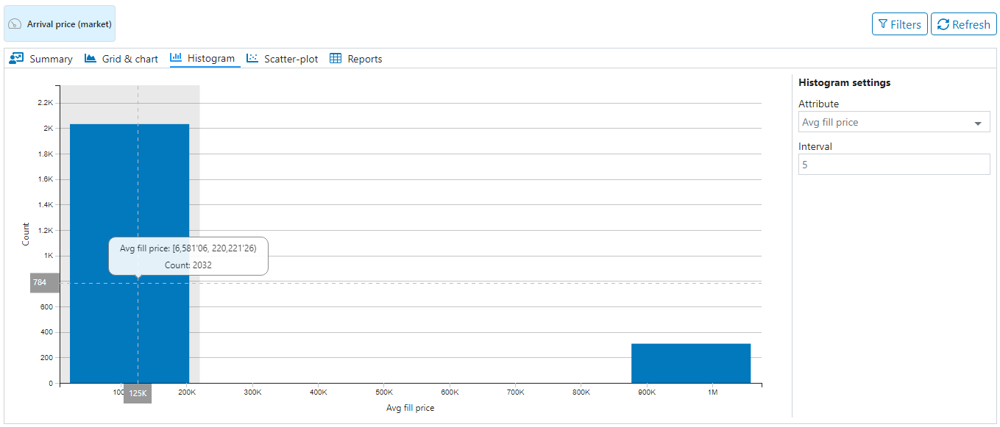
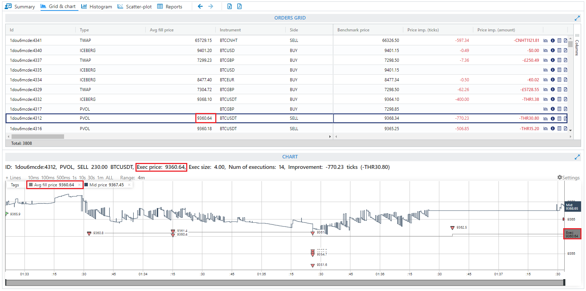
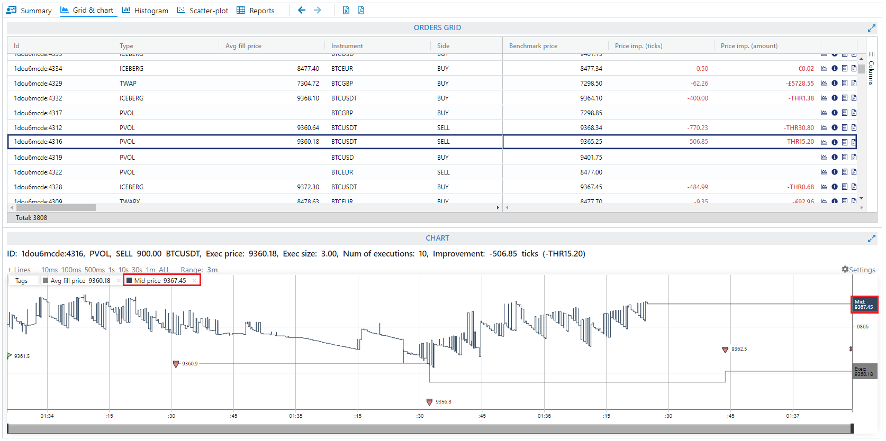
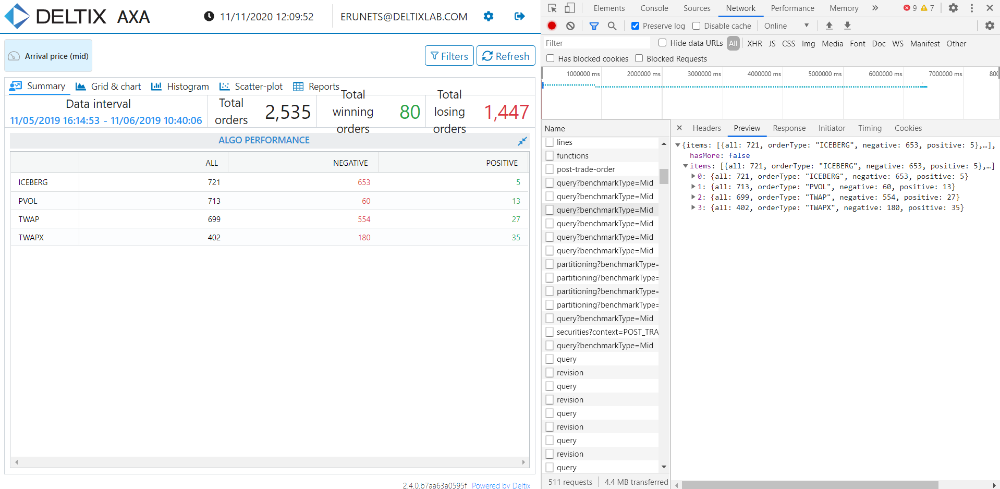

# Условия итогового задания - выполнить все тест кейсы

# Test-Cases

| **Module name** | **#** | **Test-case name** | **Autotest name** |
| ----------------| ----- | ------------------ | ----------------- |
| [Login](#login) | TC01  |[Login and check main components](#tc01-login-and-check-main-components) | |
| [Histogram View](#histogram-view) | TC04  |[Hover over a bar](#tc04-hover-over-a-bar) | |
| [Scatter-plot View](#scatter-plot-view) | TC10  |[Check Attributes and Intervals change](#tc10-check-attributes-and-intervals-change) | |
| [Chart](#chart)|TC14|[Check Avg fill price and Mid price](#tc14-check-avg-fill-price-and-mid-price)| |
| [Orders Grid](#orders-grid) | TC46  |[Check columns visibility](#tc46-check-columns-visibility) | |
| [Grid Sorts & Dashboards](#grid-sorts-dashboards) | TC68  |[Check sort](#tc68-check-sort) | |
| [Summary Dashboard](#summary-dashboard) | TC106 | [Check Algo performance grid](#tc106-check-algo-performance-grid) | |

## Login

### TC01. Login and check main components

_**Test Steps:**_
1. Log in.
2. Check that main page with the following components is opened:
   *  **Settings** button
   *  **Benchmark Selector** control
   *  **Application Toolbar** with **Summary**, **Grid & chart**, **Histogram**, **Scatter-plot** and **Reports** tabs  

_**Result:**_ Pass

## Histogram View

_**Pre-condition:**_

   *  User is signed in
   
   *  **Histogram** view is opened

### TC04. Hover over a bar selection

_**Test Steps:**_
1. Hover over a bar.
2. Check boundaries and number of orders are displayed.       
      
3. Click on the bar.
4. Repeat steps 1-4 for all bars.

_**Result:**_ Pass

## Scatter-plot View

_**Pre-condition:**_

   *  User is signed in
   
   *  **Scatter-plot** view is opened

### TC10. Check Attributes and Intervals change

_**Test Steps:**_
1. Change **X Attribute**. 
2. Check that:
   *  values of axes are updated 
   *  name of the X-axis changed to **X Attribute**
3. Change **Y Attribute**.
4. Check that:
   *  grid is collapsed
   *  values are updated 
   *  name of the Y-axis is changed to **Y Attribute**
5. Repeat steps 1-4 for all attributes.

_**Test Data:**_

   *  X Attribute = Exec size 
   *  Y Attribute = Realized market impact
   *  Intervals = 10

_**Result:**_ Pass

## Chart

_**Pre-condition:**_

   *  User is signed in
   
   *  Orders Grid and Chart view is opened

### TC14. Check Avg fill price and Mid price

_**Test Steps:**_
1. Select an order.
2. Click on **+ Lines**.
3. Toggle the visibility of **Avg fill price** and **Mid price** in the Prices section.
4. Select an order with executions.
5. Check that:
   *  the value of *Exec* in the tooltip matches with *Avg fill* price in the **Interactive legend** control, **Order info string** and in the **grid**
   *  color of *Exec* line matches with text color of *Price imp. (ticks*) and *Price imp. (amount)*     
   
   *  the value of *Mid price* in the **Interactive legend** control matches with its value in the tooltip     

_**Result:**_ Pass

## Orders Grid

### TC46. Check columns visibility       

_**Test Steps:**_
1. Open **Filter Configurator** control and check/uncheck the column. 
2. Make sure the column appears/disappears from the grid.
3. Open **Tool panel** and check/uncheck the column.
4. Make sure the column appears/disappears from the grid.
5. Open filter for any column and switch to the 3rd tab.
6. Check/uncheck the column.
7. Make sure the column appears/disappears from the grid.
   
_**Result:**_ Pass

## Grid Sorts & Dashboards 

### TC68. Check sort         

_**Test Steps:**_
1. Click on the column header to apply sort.
2. Make sure the sort is applied.
3. Click on the column header the 2nd again.
4. Make sure the sort order is reverted. 
5. Click on the column header the 3rd time.
6. Check the sort is reset.
7. Repeat steps 1-6 for *Floating-point*, *Integer*, *Timestamp* and *String* columns. 
   
_**Result:**_ Pass

## Summary Dashboard

### TC106. Check Algo performance grid

_**Test Steps:**_
1. Open **Dev Tools** -> **Network**.
2. Select query and switch to **Preview**.
2. Check all, negative and positive values in **Network** match with values in **Algo performance**.  

  

_**Result:**_ Pass
